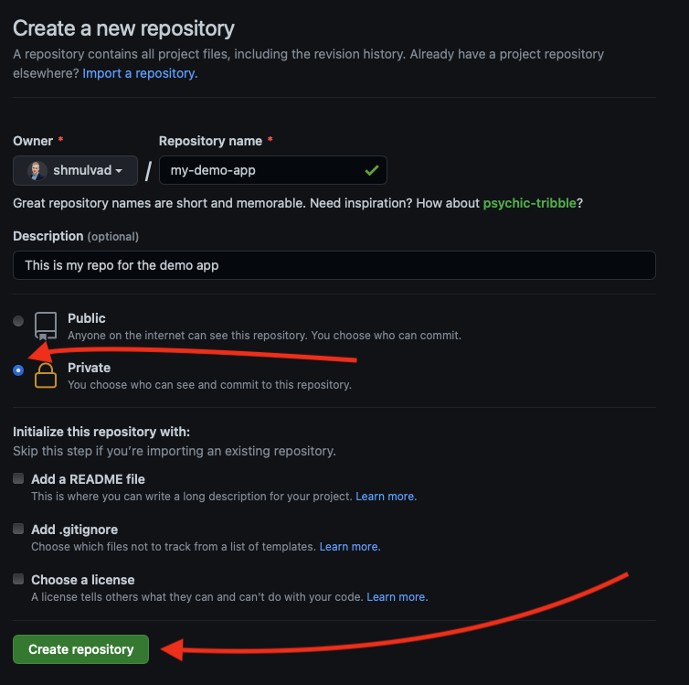
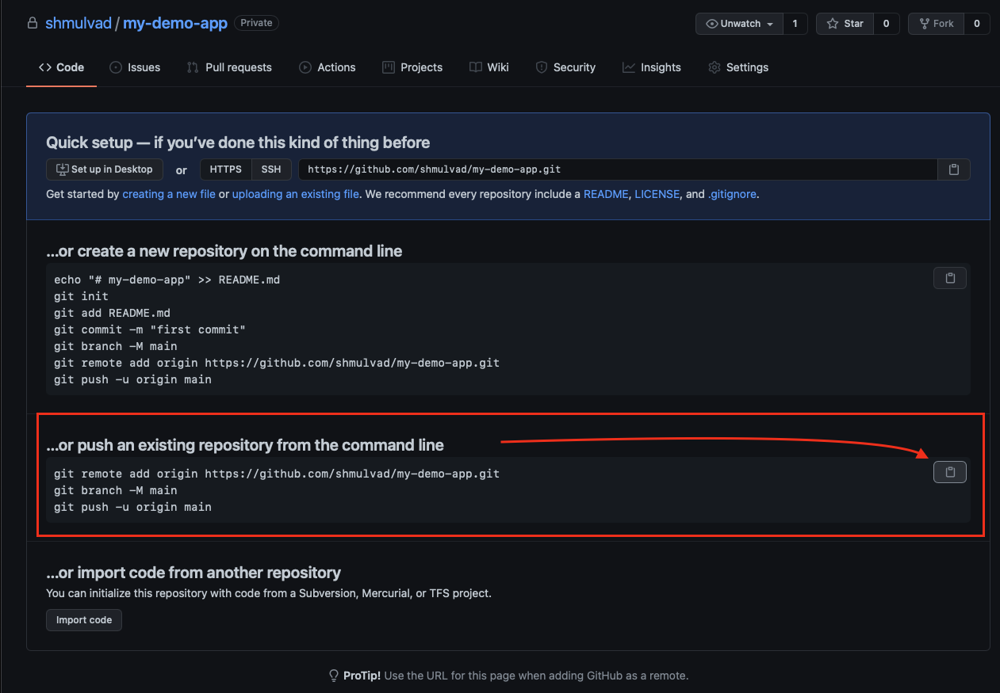
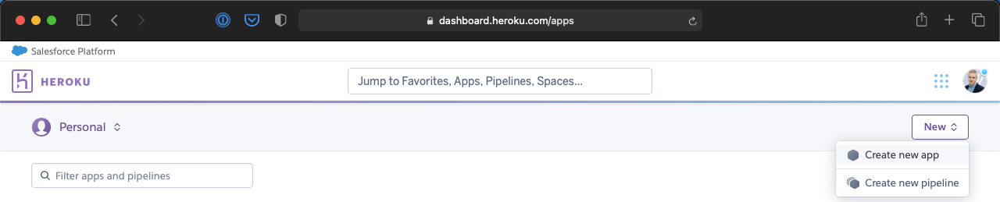
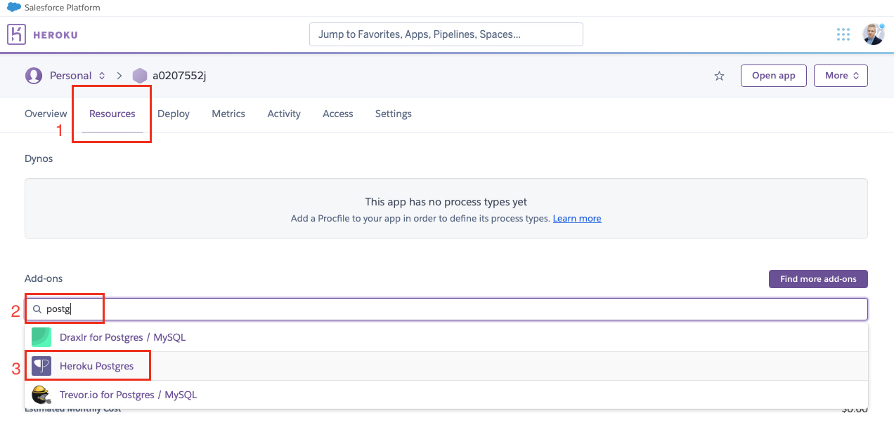
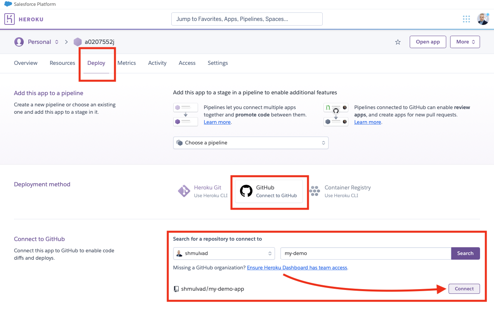
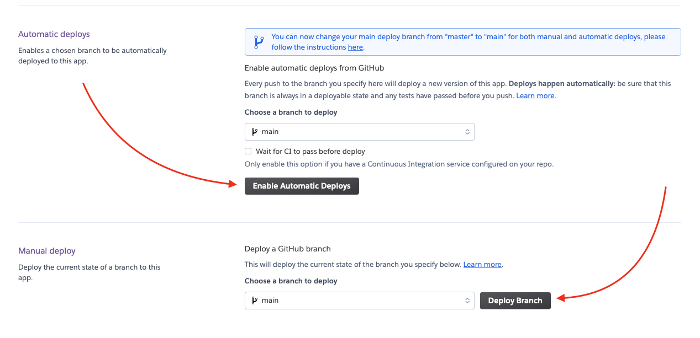

# BT5110 - Your first Django app

A barebones Django app used for the [BT5110](https://nusmods.com/modules/BT5110/data-management-and-warehousing) module at NUS. Shows how to create a web app that

1. Interacts with a database
2. Is deployed to the internet (for free!)

This template starter code is heavily based on [Python: Getting Started](https://github.com/heroku/python-getting-started.git).

## Running Locally

Make sure you have [Python 3.9](https://docs.python-guide.org/starting/installation/) and [Git](https://git-scm.com/book/en/v2/Getting-Started-Installing-Git) installed. Also make sure you have PostgreSQL running and create a new database for local development. Then run the following in a terminal:

```sh
$ git clone https://github.com/BT5110/demo.git
$ cd demo
```

This will download the code to your computer. One of the files will be called [`.env-sample`](/.env-sample). Make a new file called `.env` where you copy the contents over, and then you can set the values as you desire (namely, make sure `LOCAL_DB_NAME` and `LOCAL_DB_USER` are correctly configured).

Now run the following to finish the setup:

```sh
$ python3 -m venv .venv
$ source .venv/bin/activate
$ pip install -r requirements.txt

$ python manage.py migrate
$ python manage.py collectstatic
$ python manage.py runserver
```

Your app should now be running on [localhost:8000](http://localhost:8000/).

## Deploying to Heroku

Make sure you have followed the steps above to run it locally. Then:

1. Create a new private repository on GitHub
    * Go to <https://github.com/new>.
    * Name your repository whatever you like. **NB**: Make sure to choose "Private" - this is a requirement to avoid that other students plagiarise your code for the assignment. Also make sure to **not** check any of the boxes under "Initialize this repository with". When you are done, click *Create repository*.
    
    * Copy the commands under *"...or push an existing repository from the command line"* to push the code you cloned for running locally.
    
2. Create the deployment on Heroku
	* Go to <https://dashboard.heroku.com/new-app> and click *Create new app*
	
	* Name your app whatever you like. For region, Heroku sadly doesn't support Asia. You can choose either Europe or United States. Click *Create app*.
	* Go to *Resources*, Under *Add-ons* search for "postgres" and select it as shown here (you might need to click "Submit Order Form", just make sure you choose the free hobby dev):
	
	* Go to "Deploy", choose GitHub, connect your GitHub account, search for the repo you created previously to connect to, click "Connect".
	
	* Deploy your app in its current state, and do such that Heroku automatically deploys changes whenever you push your code to GitHub.
	
3. After 1-2 min, you should be able to see your page at `your-app-name.herokuapp.com`!


